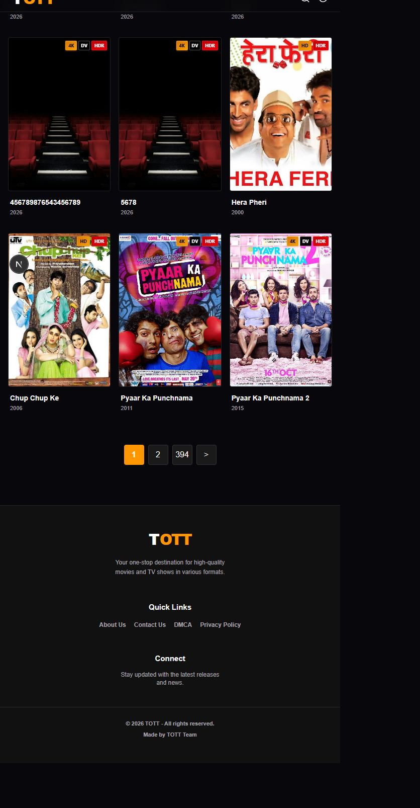

# TOTT Live QA Report

**Date:** 2026-09-28  
**Live URLs:** [Homepage](https://tott.netlify.app/) | [Admin](https://tott.netlify.app/admin)  
**Local source:** `main`, aligned with `origin/main` before these uncommitted changes

## Summary

- Homepage loaded with HTTP 200. The hero and movie shelves rendered. The browser also reported repeated aborted requests for `/trailers/loveaajkal.mp4`; this may be carousel/media cancellation and needs a separate asset/network check.
- Admin login succeeded on the deployed site. The live admin page still uses a client-side password check.
- MongoDB read/write path works: the API returned 5 movies before the test; a temporary test movie was inserted and appeared in the API response (6 total), then deleted successfully. The API returned to 5 movies and the test title is absent.
- While the test record existed, the live homepage had zero exact matches for the titles returned by `/api/movies`. MongoDB persistence worked; the deployed page did not render those API records.
- A local fix now renders cards from `/api/movies`. In a browser test with the five real production API titles and response shape, all five appeared in “Latest Releases”; screenshot proof is linked below. This is a local render test, not a new live deployment.
- No real production movie was changed or deleted. The temporary record was removed.

## Findings

### Critical: Movie write APIs have no server-side admin authorization on the deployed site

The deployed, non-mutating checks returned `400 Title is required` for an empty POST and `400 Movie ID is required` for a DELETE without an ID. Both requests reached route validation without a session; a server-side auth guard should reject them with `401` first. No unauthorized valid write/delete was attempted.

In the local source, the old admin password was compared in client JavaScript, while `POST` and `DELETE /api/movies` had no authorization check. Anyone who discovers the API could bypass the UI login and mutate movie records.

**Local fix made:** Added a server-issued, HMAC-signed 8-hour session in an HttpOnly cookie, moved password verification to the server, and require a valid session for movie POST/DELETE. `GET /api/movies` remains readable for public listings.

### High: `.env.local` was tracked by Git

The environment file was present in the Git index. It has been removed from the index while its local copy remains on disk. Its contents were not opened or copied into this report. The repository `.gitignore` was reverted by the user and has not been changed again; therefore `.env.local` currently appears as an untracked file and must not be accidentally staged.

If real database/API credentials were ever committed, rotate them in MongoDB/third-party dashboards and replace them in Netlify. Removing a file from the next commit does not erase prior Git history.

### High: Published database entry did not appear on the public homepage

The inserted movie was present in `/api/movies`, but its title was absent from the HTTP 200 homepage response during the test. A direct browser comparison also found zero exact matches between the five movie API titles and the live homepage card headings. The production deployment appears different from the checked-out `main` UI (for example, the current local admin includes an OMDB fetch section that was not present in the live admin snapshot).

**Local fix made:** The “Latest Releases” grid now refreshes its database movies from `/api/movies` on the client and merges those results with the static catalog. This uses the same API that returned the inserted movie, instead of relying only on a separate page-render database query.

**Deployment status:** The fix is on the local `main` worktree only. Netlify has not been updated, so the live homepage still needs a deployment and a production retest before this issue can be called fixed in production.

### Medium: Open admin tab can show stale movie state

The admin tab retained the test card after the record was deleted through a separate API session. Reloading and logging in again fetched the current list and showed the original five records. This was client-side in-memory state, not a failed MongoDB deletion.

## Source Changes Made

- Added `lib/admin-auth.ts` for password verification, signed-token validation, and session expiry.
- Added `app/api/admin-auth/route.ts` for login, session status, and logout.
- Updated `app/api/movies/route.ts` to reject unauthenticated POST/DELETE requests.
- Updated `app/admin/page.tsx` to use the server session instead of a client-side password constant.
- Added `components/LatestMoviesGrid.tsx` to refresh and render database cards from `/api/movies`.
- Updated `app/page.tsx` to split database cards from the static catalog and pass both into the latest grid.
- Removed `.env.local` from Git tracking while preserving the local file. This deletion is staged but not committed.
- The user reverted the `.gitignore` edit; it remains unchanged.

These source changes are local and uncommitted on `main`; Netlify has not been updated by this work.

## Verification

- Live MongoDB/API test: insert succeeded; delete succeeded; final count `5`; test title absent.
- Live homepage before the fix: HTTP `200`; zero exact card-title matches for the five movie titles in the API.
- Local browser render test: intercepted `/api/movies` with the five current production API titles and fields; verified all five exact titles under “Latest Releases”. This test did not mutate MongoDB.
- Live unauthenticated validation probes: POST without title and DELETE without ID both returned `400`, not `401`.
- Local API guard: no-cookie POST and DELETE returned `401`.
- Focused ESLint on `app/api/admin-auth/route.ts` and `lib/admin-auth.ts`: passed.
- Focused ESLint on `app/page.tsx` and `components/LatestMoviesGrid.tsx`: passed.
- `npx tsc --noEmit`: passed after typing the homepage movie collection.
- Project-wide ESLint still reports existing `any` lint errors and a React effect lint error in admin/API files; the new homepage files pass the focused lint check.
- Editor diagnostics for the homepage files: no errors.
- Local login returned `503` because the new `ADMIN_PASSWORD` and/or `ADMIN_SESSION_SECRET` configuration is incomplete in the local environment; successful signed-cookie login was therefore not verified locally.

## Required Before Deploy

Configure `ADMIN_PASSWORD` and a long, random `ADMIN_SESSION_SECRET` in Netlify for the production context before deploying the local auth changes. Do not reuse the previous client-side password as the session secret. Then verify wrong-password login fails, correct login sets the HttpOnly cookie, and POST/DELETE return `401` without it.

## Screenshots

